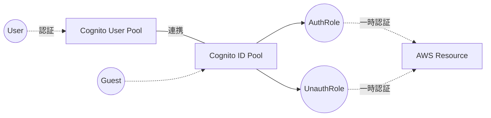

# Cognito 認証

AWSを使用する場合、認証は Cognito を使用すると連携がスムースです。

## ユーザープール

ユーザープールとはユーザー情報を保存するデータベースです。ユーザー毎に ユーザーID、パスワード、その他のカスタム情報 を登録できます。

### アプリケーションクライアント

ユーザープールの中には **アプリケーションクライアント** という概念があります。  
これは、１つの ユーザープールに対して複数作成することが可能で、アプリケーション毎にエンドポイントを作成して設定をカスタマイズできる機能です。

## IDプール

IDプールはユーザープールにアタッチして使用するもので、認証ユーザー（またはゲストユーザー）に **AWSリソースアクセスをするための一時権限** を付与する非常な重要な機能を持ちます。  
IDプールは１つのユーザープールに対して複数作成できるのでアプリ別で作成することができます。

### IDプールに紐づける２つのIAMロール

IDプールには以下のIAMロールを選択または新規作成してアタッチできます。

- **AuthRole（認証ユーザー権限）**
- **UnauthRole（ゲストユーザー権限）**

### IDプールが必要なケース

- アプリ側から直接S3にファイルをアップロードする。
- アプリ側から直接Kinesisにイベントを発行する。

## ポイント

上記で示した構成であることから実際に構築する際のポイントは、 **ユーザープールはSAMなどの IaCツール ではアプリと一緒に作成せず独立して作成するのが望ましい** でしょう。