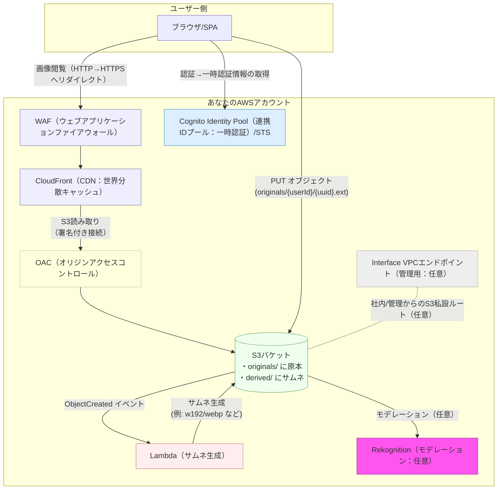
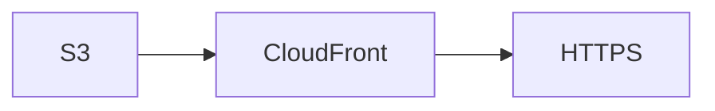
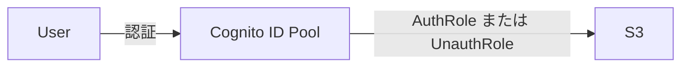

# S3画像のホスティング

S3から直接ホスティングせず、Cloudfrontを通じて配信するようにしましょう。

## 全体設計

## 画像の読み出し

決まったパスをCloudfrontからPublicにホスティングするため、どこからでもHTTPS経由で表示できます。

## 画像の登録

画像がアプリ側から直接S3に登録します。

API Gateway経由にすることもできますが、制限があるため AWS SDK を使用して直接S3にアップロードする方法が一般的です。

この時、アプリ側に直接IAM情報をハードコートすると危険なので、必ず一時認証の Cognito ID Pool に紐づけたIAMロール（AuthRoleまたはUnauthRole）に権限をアタッチするようにしましょう。

### 画像の加工

デバイス別、サムネイル用など１つの画像から複数サイズの画像もS3トリガーを使用してLambdaで自動生成することができます。
